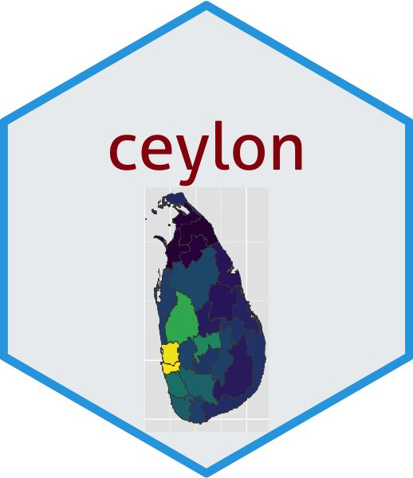

```{r setup, include=FALSE}
knitr::opts_chunk$set(echo = TRUE)
library(knitr)

```

# <span style="color:darkblue;">Chapter 1 : Introduction to Spatial Data Visualization
\

## 1.1 Spatial Data Visualization

Spatial analysis utilizes spatial data to derive results based on the geography of the target area. This involves examining attributes, relationships, and locations present in the data, revealing both geometric and geographic attributes. By employing computational models, algorithms, and analytical methods, spatial analysis integrates geographical information to determine its relevance for a given context.

Spatial data visualization plays a vital role in presenting findings related to spatial analysis. By translating data into visual formats like maps, charts, and graphs, it enhances comprehension, analysis, and communication of complex geographic information.

This analytical approach holds significance across various sectors. It aids healthcare, agriculture, urban ecosystem management, disaster preparedness, supply chain modeling, and more, enabling informed decisions and strategies based on geographic insights.

Geometric data represents spatial information on 2D surfaces, facilitating applications like Google Maps for navigation. On the other hand, geographic data, representing latitude and longitude, is overlaid on Earth's spherical surface. For instance, GPS devices offer detailed geographic information. This distinction in data types underscores the importance of spatial analysis and visualization in understanding and harnessing geographic information effectively.


### 1.1.1 Introduction to Spatial Data Analysis and Visualization in R

R stands as an open-source software environment dedicated to statistical computing and graphics. Within its framework, a variety of specialized packages are available, enhancing its capabilities for managing spatial data and executing intricate spatial analysis tasks.


### 1.1.2 R packages for spatial data analysis

- rgdal
- sp
- rgeos
- raster
- sf
- tmap
- leaflet
- ggmap

- maptools
- gstat
- spatstat
- stars
- geosphere
- RgoogleMaps
- rasterVis


### 1.1.3  Geospatial vector data structures

```{r,echo=FALSE,warning=FALSE,message=FALSE}

library(tidyverse)
library(magrittr)
library(urbnmapr)
library(usmap) # to obtain population data
library(ggthemes)
library(scales)
library(geofacet)

library(ggspatial)

library(viridis)


household_data <- left_join(countydata, counties, by = "county_fips") 


county_centroids <- summarize(group_by(household_data, county_fips), x = mean(range(long)), y = mean(range(lat)))

county_income <- select(household_data, income = medhhincome, county_fips)
county_income <- inner_join(county_income, county_centroids, "county_fips")


```

```{r  ,fig.cap="*Figure 1.1* : ",echo=FALSE,message=FALSE,warning=FALSE,comment=NA}


household_data %>%
  ggplot() +
  geom_polygon(aes(long, lat, group = group), fill = NA, col = "gray") +
  geom_point(aes(x, y, colour = income), data = county_income, alpha=0.5, size=0.2) + scale_size_area() +
  coord_map("bonne", parameters=45) + ggthemes::theme_map() 


```
              


Here we can see three things. One is area. And the observations are recorded through the points. So we can see points observations. And the other one is line to separate the area.


Spatial data can be expressed in several formats, including vector and raster. Vectors graphically represent the real world through points, lines, and polygons.

 - <span style="color:red;">Point:.</span> - Individual longitude and latitude of locations (Points is a single value. That represent using x and y.)

     Eg : Locations, Buildings
     
 - <span style="color:red;">Lines:.</span> - Two or more vertices or points that are connected (Lines are the sequence of x and y and they should be connected.)
     
     Eg: Roads, rivers

 - <span style="color:red;">Polygons:.</span> -  Three or more vertices and closed (In order to separate the regions we used polygons.)
     
     Eg: Area of a country, state, district
     
With the help of points, one can create lines, which further give rise to enclosed spaces in the form of polygons. These vector data types allow the graphical mapping of physical objects found on the Earth’s surface.  


```{r ,echo=FALSE,warning=FALSE,message=FALSE}

library(ggplot2)
theme_set(theme_bw())
library(sf)    
library(gridExtra)
library(rnaturalearth)
library("rnaturalearthdata")

world <- ne_countries(scale = "medium", returnclass = "sf")


```


### 1.1.4 How to transform this three dimensional angular system to a two dimensional cartesian system?

```{r, ,fig.cap="*Figure 1.2 * : Histogram of Latex extraction by Zone",echo=FALSE,message=FALSE,warning=FALSE,comment=NA}

p1 <- ggplot(data = world) +
  geom_sf() +
  coord_sf(crs = "+proj=laea +lat_0=52 +lon_0=10 +x_0=4321000 +y_0=3210000 +ellps=GRS80 +units=m +no_defs ") + 
  ggtitle("Globe - 3D")

p2 <- ggplot(data = world) +
  geom_sf(aes(fill = pop_est)) + xlab("Longitude") + ylab("Latitude") +
  scale_fill_viridis_c(option = "plasma", trans = "sqrt") + ggtitle("2D Space")

grid.arrange(p1, p2, ncol = 2, widths = c(3, 7))

```

In spatial analysis this is very challenging plots. Reason is we have 3D globe, that is what do we want to plot. But when its comes to plotting we have to plot in 2D surface.

## 1.2  Map projections 

Frequently, we utilize maps in our daily lives to the extent that we might overlook the fact that a map is essentially a flat portrayal of the Earth's three-dimensional form. Over many years, geographers and mathematicians have pondered the optimal methods for accomplishing this task. Indeed, map projections are categorized into different types based on their mathematical transformations that convert the Earth's spherical surface into a 2D map.

### 1.2.1 What are map projections?

  * Cylindrical projections

  * Conical projections

  * Planar projections

```{r ,fig.cap="*Figure 1.3 * : Types of map projections", echo=FALSE,message=FALSE,warning=FALSE,comment=NA} 
 

``` 

<span style="color:blue;">Cylindrical projections.</span> map the Earth's surface onto a cylinder. They are often used for world maps and result in straight meridians (lines of longitude) and parallel lines that intersect at right angles. Depending on how the cylinder is positioned in relation to the Earth, cylindrical projections can be equatorial, transverse, or oblique.

Common examples of cylindrical projections include:

  * Mercator Projection
  * Miller Cylindrical Projection
  * Robinson projection 

```{r,fig.cap="*Figure 1.4* : Robinson Projection Map", echo=FALSE,message=FALSE,warning=FALSE,comment=NA} 
world_map <- ne_countries(scale = "medium", returnclass = "sf")
robinson_proj <- "+proj=robin +lon_0=0 +x_0=0 +y_0=0 +ellps=WGS84 +datum=WGS84 +units=m +no_defs"

world_map_robinson <- st_transform(world_map, crs = robinson_proj)

ggplot() +
  geom_sf(data = world_map_robinson, fill = "lightblue", color = "black") +
  coord_sf(crs = robinson_proj) +
  labs(title = "Robinson Projection Map")

``` 


Unfolding a cone onto a flat surface leads to the formation of a distinct space, or gap. The extent of this gap, characterized by its size or angle, is influenced by the cone's width. <span style="color:blue;">Conical projections.</span> find their utility in regions of moderate latitude where the Earth's surface and the cone's surface are closely aligned, nearly parallel to each other.

Common examples of conical projections include:

  * Albers Equal Area Conic Projection
  * Lambert Conformal Conic Projection
  * Equidistant Conic Projection

```{r ,fig.cap="*Figure 1.5* :Equidistant Conic Projection Map", echo=FALSE,message=FALSE,warning=FALSE,comment=NA} 
equidistant_proj <- "+proj=eqdc +lon_0=0 +lat_0=0 +lat_1=30 +lat_2=60 +x_0=0 +y_0=0 +ellps=WGS84 +datum=WGS84 +units=m +no_defs"

world_map_equidistant <- st_transform(world_map, crs = equidistant_proj)

ggplot() +
  geom_sf(data = world_map_equidistant, fill = "lightblue", color = "black") +
  coord_sf(crs = equidistant_proj) +
  labs(title = "Equidistant Conic Projection Map")


``` 


<span style="color:blue;">Planar projections.</span>, also referred to as azimuthal projections, transform the Earth onto a circular plane. This process can be achieved through various approaches, which can be elucidated by considering the placement of an imaginary light source. This source can reside within the Earth, on its surface diametrically opposed to the plane, or at an infinite distance in relation to the plane. Planar map projections frequently find application in representing a particular country or continent.

Common examples of planar projections include:

  * Stereographic Projection
  * Lambert Azimuthal Equal-Area Projection
  * Gnomonic Projection
  

```{r ,fig.cap="*Figure 1.6* :Lambert Azimuthal Equal-Area Projection Map", echo=FALSE,message=FALSE,warning=FALSE,comment=NA} 
lambert_azimuthal_proj <- "+proj=laea +lat_0=0 +lon_0=0 +x_0=0 +y_0=0 +ellps=WGS84 +datum=WGS84 +units=m +no_defs"

world_map_lambert <- st_transform(world_map, crs = lambert_azimuthal_proj)

ggplot() +
  geom_sf(data = world_map_lambert, fill = "lightblue", color = "black") +
  coord_sf(crs = lambert_azimuthal_proj) +
  labs(title = "Lambert Azimuthal Equal-Area Projection Map")


``` 

Each of these categories includes specific projection methods that are suitable for different applications and regions. It's important to choose a map projection that best suits the purpose of your map while understanding the trade-offs between preserving various properties like area, shape, distance, and direction.

Prior to selecting a projection, it's crucial to recognize that governmental bodies across countries and continents have established standard projections for spatial data mapping. As an example, Eurostat, the EU's statistical agency, employs the Lambert Azimuthal Equal-Area projection as a European standard. If a standard projection exists for a given area of interest, it's advisable to use it. it's vital to acknowledge potential limitations while also remaining receptive to superior alternatives that might exist.


## 1.3 Coordinate Reference Systems (CRS)

####  What is CRS?
A Coordinate Reference System (CRS) refers to the way in which spatial data that represent the earth’s surface (which is round / 3 dimensional) are flattened so that you can “Draw” them on a 2-dimensional surface in other words it is a system used to represent geographic locations on a two-dimensional plane. It defines how spatial data is projected from the Earth's curved surface onto a flat surface. CRS includes information about units of measurement, map projection methods, and the origin point for spatial coordinates.

To define the location of something you often use a coordinate system. This system consists of an X and a Y value located within a 2 (or more) -dimensional space.

```{r ,fig.cap="*Figure 1.7* :coordinate-system", echo=FALSE,message=FALSE,warning=FALSE,comment=NA} 
knitr::include_graphics("coordinate-system.png") 

``` 

While the above coordinate system is 2-dimensional, we live on a 3-dimensional earth that happens to be “round”. To define the location of objects on the Earth, which is round, you need a coordinate system that adapts to the Earth’s shape. When you make maps on paper or on a flat computer screen, you move from a 3-Dimensional space to a 2-Dimensional space . The components of the CRS define how the “flattening” of data that exists in a 3-D globe space. The CRS also defines the the coordinate system itself.

```{r ,fig.cap="*Figure 1.8* :geographic-origin", echo=FALSE,message=FALSE,warning=FALSE,comment=NA} 
knitr::include_graphics("geographic-origin.png") 

``` 

####  The Components of a CSR

* **Coordinate system**: \
The X, Y grid upon which your data is overlayed and how you define where a point is located in space.

* **Horizontal and vertical units**: \
The units used to define the grid along the x, y (and z) axis.

* **Datum**: \
A modeled version of the shape of the Earth which defines the origin used to place the coordinate system in space. You will learn this further below.

* **Projection Information**: \
The mathematical equation used to flatten objects that are on a round surface so you can view them on a flat surface.

####  Why is CRS important in spatial data?
Choosing the right CRS is crucial for accurate spatial data visualization. Incorrect CRS selection can lead to distortion, misalignment, and inaccurate analysis. CRS affects how data is displayed on maps, impacting distances, angles, and area measurements. Using the correct CRS ensures that your spatial data is accurately represented.


#### Types of Coordinate Reference Systems

#### Geographic CRS
Geographic CRS uses a spherical coordinate system to define locations on the Earth's surface. It's ideal for global datasets and measures latitude and longitude in degrees. Common examples include WGS 84 (EPSG:4326).\

#### Projected CRS
Projected CRS involves transforming the Earth's curved surface onto a flat plane. This reduces distortion in specific regions but distorts other areas. Projected CRS is useful for localized mapping and preserves distances and areas more accurately than geographic CRS.\

#### How to choose the right CRS?

**Match CRS to your data**\

Select a CRS that matches the geographic scope of your data. Global datasets may benefit from geographic CRS, while local datasets might require a projected CRS.\

**Consider the purpose of your visualization**\

Choose a CRS that supports your visualization goals. Some CRS are better for navigation, while others are optimized for preserving distances or area accuracy.\

####  Working with CRS in R

**Loading spatial packages**\
To work with spatial data and CRS in R, load packages

**Reading and plotting spatial data with CRS**\
Read spatial data files using functions like st_read() from the sf package. Plot spatial data using ggplot2 while specifying the CRS with coord_sf(crs = ...).\

**Transforming and reprojecting spatial data**\
Change the CRS of spatial data using st_transform(). This ensures data is projected correctly.\ Use st_crs() to see the current CRS of a spatial object.\

**Assigning CRS to data**\
If reading spatial data from sources without CRS information, assign it using st_crs<-.

####  Common CRS and Examples

**WGS 84 (EPSG:4326)**

* Widely used geographic CRS

* Latitude and longitude in degrees

* Suitable for global datasets

**Web Mercator (EPSG:3857)**

* Common projected CRS for web maps

* Preserves shapes but distorts sizes

* Suitable for online interactive maps


## 1.4 Shapefiles

#### What are shapefiles?

A shapefile is a popular file format for storing spatial data. It consists of multiple files that together describe geographic features such as points, lines, and polygons. These files include geometry data (shapefile) and associated attribute data (dBASE table).

####  The Components of Shapefiles
A shapefile consists of several files with the same base name but different extensions\

* **.shp**: Contains the geometry (points, lines, polygons).

* **.shx**: Index file for fast access to geometry.

* **.dbf**: Attribute data in a dBASE table.

* **.prj**: Describes the coordinate reference system (CRS).

#### Why Shapefiles for Spatial Data Visualization?

* **Flexibility and compatibility** \
Shapefiles are widely supported by GIS software and libraries, making them a versatile choice for sharing spatial data across different platforms.

* **Geographic information storage** \
Shapefiles store both geometry and attribute data, allowing you to represent detailed information about geographic features.

#### Working with Shapefiles in R

* **Loading shapefiles using 'sf' package** \

Use the sf package to read shapefiles into R. The st_read() function is commonly used for this purpose.

* **Basic exploration of shapefile data** \

Use functions like st_layers() to list available layers, and st_geometry() and st_attributes() to inspect geometry and attributes.

* **Plotting shapefile data using ggplot2** \

Combine the power of the sf and ggplot2 packages to create customizable maps that highlight your data's geographic features.

#### Attributes and Geometry

* **Understanding attribute data** \
Attributes provide additional information about each geographic feature. Use functions like st_drop_geometry() to access only attribute data.

* **Manipulating geometries and attributes** \
Perform spatial operations such as buffering, clipping, and more to modify both geometries and attributes.

#### Layering and Combining Shapefiles

* **Overlaying different shapefile layers** \
Use functions like st_intersection() to overlay layers, revealing interactions between geographic features.

* **Merging shapefiles** \ 
Combine shapefiles with similar geometries using functions like st_union() or rbind().

#### Converting and Creating Shapefiles

* **Converting other data formats to shapefiles** \

Use functions like st_as_sf() to convert data frames or other spatial formats into shapefiles.

* **Creating shapefiles from scratch**  \

Generate shapefiles by defining geometries and attributes using the sf package's data structures.


## 1.5 Polygon maps & Simple feature map
There are two types of maps.\
\
*             Polygon maps  
*             Simple feature map


In this manual we are addressing only  the "Simple Feature Map".


## 1.5.1 Simple feature map for visualize Sri lanka using shape files.

Ceylon is an open-source R package to visualize Sri Lanka map and is obtained the most valuable insights from the data.

```{r ,fig.cap="*Figure 1.9* :ceylon package",echo=FALSE, out.width = "20%", fig.align="center"}

```

```{r,warning=FALSE,echo=FALSE}
library(ggspatial)
```

**Install ceylon package**

Firstly ceylon package is installed using `install.packages`. The steps of installation are following.

```{r,eval=FALSE}
install.packages("devtools")
devtools::install_github("thiyangt/ceylon")
```

After that, the `ceylon` package is loaded into R using the `library()` command. 'tidyverse,' 'sp,' and 'viridis' are useful packages that can help with drawing maps.

```{r,warning=FALSE,message=FALSE}

library(ceylon)
library(tidyverse)
library(sp)
library(viridis)

```

sf_sl_o is dataset to use with mapping Sri Lanka.

```{r,warning=FALSE}
data(sf_sl_0)
class(sf_sl_0)
```

The `class(sf_sl_0)` command in R is used to determine the class or data type of an object named sf_sl_0. In this case, the output you obtained indicates that the object sf_sl_0 belongs to multiple classes:

"sf": This suggests that sf_sl_0 is an object of the 'sf' class, which typically stands for Simple Features. The 'sf' class is commonly used for representing geospatial data.

"tbl_df" and "tbl": These classes are related to data frames in R. tbl_df is from the 'tibble' package, and "tbl" is the base R data frame class. It indicates that sf_sl_0 can also be treated as a data frame-like object.

"data.frame": This class indicates that sf_sl_0 can be treated as a traditional R data frame.


```{r,warning=FALSE}
sf_sl_0
```


There are a few limitations to the approach outlined above, not least of which is the fact that the simple “longitude-latitude” data format is not typically used in real world mapping. Vector data for maps are typically encoded using the “simple features” standard produced by the Open Geospatial Consortium. The sf package (Pebesma 2018) developed by Edzer Pebesma https://github.com/r-spatial/sf provides an excellent toolset for working with such data, and the geom_sf(). geom_sf() is smart enough to know the geometry types and draw spatial objects accordingly.The geom_sf function in ggplot2 is designed to work together with the sf package.

So sf_sl_0 is not not included "logitude-latitude" data format. It's included  MULTIPOLYGON geometry type.

Using sf_sl_0, Sri lanka map can be visualiazed this way.


```{r,fig.cap="*Figure 1.10* :Visualizing using shapefiles: map of Sri Lanka"}

ggplot(sf_sl_0) + geom_sf()

```


#### Color the map

```{r,fig.cap="*Figure 1.11* :Visualizing using shapefiles: map of Sri Lanka"}
ggplot(sf_sl_0) +
  geom_sf(fill='yellow') +  # color the map 
theme_minimal()  # A minimalistic theme with no background annotations
```

#### The inclusion of a north arrow on a map

```{r ,fig.cap="*Figure 1.12* :Visualizing using shapefiles: map of Sri Lanka"}
ggplot(sf_sl_0) +
  geom_sf(fill='beige') +
ggspatial::annotation_north_arrow(location = "br")+ #add a north arrow 
  ggspatial::annotation_scale(location = "bl")
```

#### **Visualization of Provinces of Sri Lanka and Districts of Sri Lanka**
The province includes the geometry related to the province, as well as the population of the related province. Similarly, the district includes the geometry and population related to the district.


```{r, fig.cap="*Figure 1.13* :Visualization of Provinces of Sri Lanka and Districts of Sri Lanka",warning=FALSE, message=FALSE}
library(gridExtra)
province_map<- ggplot() + geom_sf(data = province) + labs(title = "Provinces of Sri Lanka")
district_map<-ggplot() + geom_sf(data = district) + labs(title = "Districts of Sri Lanka")
grid.arrange(province_map, district_map,ncol =2)
```

```{r,fig.cap="*Figure 1.14* :Color-Coded Map of Sri Lanka by Province and District",warning=FALSE, message=FALSE}
library(gridExtra)
data(province)
data(district)
province_map_fill <- ggplot(province) + geom_sf(mapping = aes(fill = PROVINCE), show.legend = FALSE) + labs(title = "Provinces of Sri Lanka")
district_map_fill<- ggplot(district) + geom_sf(mapping = aes(fill = DISTRICT ), show.legend = FALSE) + labs(title = " Districts of Sri Lanka")
grid.arrange(province_map_fill, district_map_fill,ncol =2)
```

If you want to add a new column with respect to province or district, and your dataset includes district information, you can load the dataset with the variable (column) you want to plot. After that, you can combine the district dataset with the new dataset, and then proceed to create your plot.

**For Example** -

#### **Distribution of net extent harvested in hectares by districts**

The 'DISTRICT WISE' dataset has been loaded into R. This dataset includes information regarding the total paddy production in metric tons and the net extent harvested in hectares for the Yala season of 2022, categorized by district. This data has been sourced from the Department of Census and Statistics(http://www.statistics.gov.lk/Agriculture/StaticalInformation/PaddyStatistics/MetricUnits/IncludingMahaweli/2022Yala). The first step involves merging the 'DISTRICT WISE' dataset with the 'district' dataset, which contains geometrical information for each district. In Jaffna district net harvested and total paddy production are not available.


**Note**

In the 'district' dataset, district information is included in the second column, and it's noteworthy that all letters are capitalized.
```{r, message = FALSE}
head(district) # show first 6 rows of district data set
```

Therefore, when combining datasets by district, it is essential that both datasets have district information in the same format.

"readxl" package is essential to load in R. Using `read_excel("Excel file Name")` We can imported data to r from  an Excel. 

```{r}
library(readxl)
library(dplyr) # required for full_join function
DISTRICT_WISE <- read_excel("DISTRICT WISE.xlsx")
head(DISTRICT_WISE)
```

`full_join()` function can be combined data by district wise. All observations of Both "district" dataset and "DISTRICT_WISE" are in production_data dataset.

```{r}

production_data <-  district %>% full_join( DISTRICT_WISE, by = "DISTRICT")
head(production_data) # show first 6 rows of production_data
```


```{r,fig.cap="*Figure 1.15* :Distribution of net extent harvested in hectares  by districts", warning=FALSE}

ggplot(production_data) + geom_sf(mapping = aes(fill = harvested), show.legend = TRUE)+  scale_fill_viridis(option = "H")  + geom_sf_text(aes(label = DISTRICT),
    size = 1.5,color="white")

```


#### **Distribution of Total paddy production in 2022 Yala season by Districts**

##### This chart shows that distribution of  by district wise.

Using `scale_fill_viridis()` , You can change color of map according option argument.  
	
A character string indicating the color map option to use. Eight options are available:

- "magma" (or "A")     `scale_fill_viridis(option = "A")`

- "inferno" (or "B")   `scale_fill_viridis(option = "B")`

- "plasma" (or "C")    `scale_fill_viridis(option = "C")`

- "viridis" (or "D")   `scale_fill_viridis(option = "D")`

- "cividis" (or "E")   `scale_fill_viridis(option = "E")`

- "rocket" (or "F")    `scale_fill_viridis(option = "F")`

- "mako" (or "G")      `scale_fill_viridis(option = "G")`

- "turbo" (or "H")     `scale_fill_viridis(option = "H")`

```{r,fig.cap="*Figure 1.16* :Distribution of total paddy production by Provinces"}

ggplot(production_data) + geom_sf(mapping = aes(fill =Total_Production), show.legend = TRUE)+   geom_sf_text(aes(label = DISTRICT),
    size = 1.8,color="white") +scale_fill_viridis(option = "E")

```

According to Figure 1.16, the districts with the highest paddy production are Ampara and Polonnaruwa. 
It's worth noting that Kurunegala has a larger harvested area compared to Polonnaruwa, but the total production in Kurunegala is lower than in Polonnaruwa. 


## 1.5.2 Mark Locations on the map.

Here,we are going to see how to add Data Point(eg-:cities,specific location)to the map in R Programming Language.


#### Step 1 - Keep the data in  “longitude-latitude” data format.

For instance,the below  data frame provided some GPS locations in Sri Lanka.Therefore,the data frame is not in “longitude-latitude” data format.


```{r,echo=TRUE,warning=FALSE,message=FALSE}
data <- data.frame(
  Location = c("Colombo", "Kandy", "Galle", "Nuwara Eliya", "Sigiriya", 
               "Trincomalee", "Anuradhapura", "Jaffna", "Ella", "Dambulla"),
  GPS = c("6.9271, 79.8612", "7.2906, 80.6337", "6.0324, 80.2170",
          "6.9497, 80.7891", "7.9544, 80.7566", "8.5874, 81.2152",
          "8.3140, 80.4158", "9.6612, 80.0250", "6.8705, 81.0447",
          "7.8554, 80.6514")
)

print(data)
```

In GPS column, the longitude-latitude data for specific location is provided together.To make the data frame into “longitude-latitude” data format ,the GPS column should be separated into two columns as “latitude" and "longitude”.

```{r,warning=FALSE,message=FALSE}
library(dplyr)
library(stringr)
#Specify the longitude and lattitude
data[c('latitude' , 'longitude')]<- str_split_fixed(data$`GPS`, ',', 2)
data$latitude <- as.numeric(data$latitude)
data$longitude <- as.numeric(data$longitude)

print(data)

```

Now,The data frame is in “longitude-latitude” data format.

#### Step 2 - Create the base map by using the geospatial data of the particular area that you interested to plot the locations. 

Since the the data frame has the locations of Sri Lanka ,the map of Sri Lanka is considered as the base map according to above example.As we discussed in the part 1.5.1,using "ceylon" package the district wise map of the Sri Lanka can be created.According the figure 1.13 the district wise map of the Sri Lanka is named as "district_map".

Therefore,according to this example the base map is named as "district_map".

#### Step 3 - Convert the regular data frame that is in “longitude-latitude” data format to spatial data frame.

**st_as_sf()** function from the sf package in R helps to convert a regular data frame into a spatial data frame (sf object) with geographic coordinates.In the function ,'data' is the data frame that you have to convert into the sf object.By 'coords' longitude and latitude columns are specified in the data frame that you have to convert into the sf object.

According to the part of 1.3 ,we learned about the Coordinate Reference Systems (CRS).As the coordinate reference system(crs), EPSG:4326 is setted in the function.It  corresponds to the WGS 84 CRS, which is one of the most commonly used CRS for representing geographic coordinates on a global scale.

The "data_sf" is the spatial data frame according to the above code.

```{r,warning=FALSE,message=FALSE}
library(sf)
data_sf <- st_as_sf(data, coords = c("longitude" , "latitude"), crs=4326)

print(data_sf)
```


#### Step 4 - Mark the locations  in the base map.

To mark specific locations in the base map the new layer should be added to the base map.According to the step 2, the base map is named as “district_map”.**geom_sf()** function is used to add the a layer to the base map.As the 'data', "data_sf" that is the  sf object according to the step 4 in this part is used.**coord_sf()** function ensures that every layer in the plot uses the same projection.

```{r ,fig.cap="*Figure 1.17* :The map of Sri Lanka",warning=FALSE,message=FALSE}
district_map+ geom_sf(data=data_sf)+ coord_sf(crs=st_crs(4326))
```

#### Step 5 -Add colours to data points

Instead of keeping the default color to mark the locations by points , by **'color'** option in the geom_sf() function , the color that you interested can be added.

```{r,fig.cap="*Figure 1.18* :The map of Sri Lanka",warning=FALSE,message=FALSE}
district_map+ geom_sf(data=data_sf, color= "red")+ coord_sf(crs=st_crs(4326))
```

#### Step 6 -Change the size of the data points.

Instead of keeping the default size of the points to mark the locations , by **'size'** option in the geom_sf() function , the size of the points that you interested can be added.

```{r,fig.cap="*Figure 1.19* :The map of Sri Lanka",warning=FALSE,message=FALSE}
district_map+ geom_sf(data=data_sf, color= "red", size= 2.5)+ coord_sf(crs=st_crs(4326))
```

#### Step 7 -Change the shape of the data points.

Instead of keeping the default shape of the points to mark the locations , by **'shape'** option in the geom_sf() function , the shape of the points that you interested can be added.Unicode characters can be used to represent shapes. For example,"\\u25A0" represents a square.

```{r,fig.cap="*Figure 1.20* :The map of Sri Lanka",warning=FALSE,message=FALSE}
district_map+ geom_sf(data=data_sf, color= "red", size= 3.0, shape="\u25A0")+ coord_sf(crs=st_crs(4326))
```

#### Step 8 -Add labels  to data points.

To specify the data points,the labels can be added to the map.Using the **geom_sf_label()** function , the labels can be added to data points when you are working with the spatial data frame(sf object).**check_overlap = TRUE** ensures that labels do not overlap.By using **nudge_y = 0.05**,   the labels can be  shifted lightly upwards on the y-axis.

```{r,fig.cap="*Figure 1.21* :The map of Sri Lanka",warning=FALSE,message=FALSE}
district_map + 
  geom_sf(data = data_sf, color = "red") +
  geom_sf_label(aes(label = Location),data_sf,check_overlap = TRUE, nudge_y = 0.05,
    size = 2, label.padding = unit(0.5, "mm"))  +
  coord_sf(crs = st_crs(4326))
```


## 1.6  Projecting data into same Coordinate Reference System (CRS).
This section allows you to understand about the significance of understanding CRSs and data projecting in spatial data analysis

As we discussed about CRS (chapter 1.3), we know there are different types of CRS, each serving a specific purpose based on the region, scale, and measurement needs.When you are working with different data stored in different coordinate systems, they won't align correctly when overlaid on maps or used in analyses.So it is important to know about data projecting.

Data projecting is about transform all your data to a common CRS before performing any analysis using GIS software like ArcGIS, QGIS, or programming libraries like sf in R supports on-the-fly projection. This approach ensures that the data is consistently aligned.

So here below example explained about data projecting.

### Example

You first need to load below libraries to try this example.

```{r 1, echo=TRUE, warning=FALSE, message=FALSE}

library(ggplot2)
library(sf)
library(ceylon)
library(tidyverse)
library(sp)
library(viridis)

```
\
First we generate map below shows all of the province in the Sri Lanka. 


```{r 2 ,fig.cap="*Figure 1.22* :Province Map (CRS = 5235 )"}

# Plot the map using ggplot2 and geom_sf
map1 <- ggplot() +
  geom_sf(data = province) +
  theme_minimal() +
  labs(title = "Province Map (CRS = 5235 )")

map1
```

Then we add three locations to above map.Suppose we add points belongs to Colombo, Jaffna, Galle.Here is the Latitude,Longitude values for those locations.


Colombo:
Latitude: 6.9271
Longitude: 79.8612

Jaffna:
Latitude: 9.6615
Longitude: 80.0255

Galle:
Latitude: 6.0324
Longitude: 80.2170


Now we store above values in data frame.Then we added them to map using geom_point.

```{r 3 ,fig.cap="*Figure 1.23* :Province Map (CRS = 5235 ) with locations"}
# define locations of Colombo, Jaffna, Galle.
# store coordinates in a data.frame
loc_df <- data.frame(lon = c(79.8612, 80.0255, 80.2170),
                     lat = c(6.9271, 9.6615, 6.0324),
                     location = c("Colombo", "Jaffna", "Galle"))

loc_df

# add a location to the map1
mapLoc1 <- map1 +
  geom_point(data = loc_df,
             aes(x = lon, y = lat, group = NULL), colour = c("springgreen", "red", "blue"),
             size = 3)

mapLoc1
```

But notice above the locations that you try to add are not in the correct location.The reason is map & points are in a different CRS. province data are in code 5235 projected CRS & above three points are in code 4236 geographic CRS. All the data should be in same CRS.

*   So here we first convert the points to the new projection.For that points are stored in a data.frame which is not a sf object. Thus, you will need to convert that into sf object.

*   We use **st_as_sf()** function to create an sf object from various types of data.
```{r 4}
# Create an sf object from the loc_df data frame.
loc_sf <- st_as_sf(loc_df, coords = c("lon", "lat"), crs = 4326)
```


*    After that we want to transform a above sf object named loc_sf from its current Coordinate Reference System (CRS) to the CRS with code 5235, which is CRS of province data.

*    We use **st_transform()** function to convert spatial data from one CRS to another.
```{r 5}
# Transform the sf object to the target CRS.
loc_sf5235<- st_transform(loc_sf, crs = 5235)

```


*    Then again we add three locations to above map.
```{r 6 ,fig.cap="*Figure 1.24* :Province Map with locations (CRS = 5235)"}

# Plot the points from loc_sld99 on the same map
mapLoc2 <- map1 +
  geom_sf(data = loc_sf5235, color = c("springgreen", "red", "blue"), size = 3) +
  labs(title = "Province Map with locations (CRS = 5235)")

mapLoc2

```

*    So now three locations are correctly added to the map.


**Similarly we can convert first province data into the same CRS of points.**

```{r  71 ,fig.cap="*Figure 1.25* :Province Map (CRS = 4326)"}
# Transform the data to CRS =4326
province_4236 <- st_transform(province, crs = 4326)

# Plot the map using ggplot2 and geom_sf
map2 <- ggplot() +
  geom_sf(data = province_4236) +
  theme_minimal() +
  labs(title = "Province Map (CRS = 4326)")

map2
```


```{r  7 ,fig.cap="*Figure 1.26* :Province Map with locations (CRS = 4326)"}

# add a location to the map2
mapLoc3 <- map2 +
  geom_point(data = loc_df,
             aes(x = lon, y = lat, group = NULL), colour = c("springgreen", "red", "blue"),
             size = 3) +
  labs(title = "Province Map with locations (CRS = 4326)")

mapLoc3

```

*   Here also we can get correct  visualization.

*   As a summary, first We need to make sure that  all the spatial data in a project are in the same Coordinate Reference System (CRS). If not, we must first convert them into same CRS then we can ensure that the geographic features are correctly positioned and sized on the map.

*   So data projecting to a common CRS is a important step to ensure the accuracy and reliability of spatial analysis and visualization.

For more details about data projecting [Visit this website](https://www.earthdatascience.org/courses/earth-analytics/spatial-data-r/intro-to-coordinate-reference-systems/)


# <span style="color:darkblue;"> Chapter 2 : Instructions for Client's Objectives

## 2.1 Visualizing Pest Disease Incidence and Distribution in Sri Lanka

This section of the manual will guide you through the process of creating visual representations of pest disease incidence and distribution in Sri Lanka in the data collected locations. Before we proceed with mapping disease incidence on the Sri Lankan map, we need to create the necessary latitude and longitude variables. This step will help us accurately position the data points on the map.
\

Requirements:\
Before you start, ensure that you have the following:

*   A dataset named "survey_data" containing the collected data
*   R libraries: ceylon,tidyverse,sp,viridis,sf,readxl

```{r , echo=TRUE, warning=FALSE, message=FALSE}
library(ceylon)
library(tidyverse)
library(sp)
library(viridis)
library(sf)
library(readxl)

survey_data <- read_excel("survey.data.xlsx")


data(sf_sl_0)
data(province)


```


#### Creating Latitude and Longitude Variables:

Here's how you can create the latitude and longitude variables in your existing dataset:

```{r adding variables}

# Split the coordinates column into latitude and longitude
coordinates_split <- strsplit(survey_data$`GPS`, ", ")

# Extract the latitude values
latitude <- sapply(coordinates_split, function(coord) as.numeric(coord[1]))
longitude <- sapply(coordinates_split, function(coord) as.numeric(coord[2])) 

latitude <-as.data.frame(latitude)
longitude <- as.data.frame(longitude)

survey_data <- cbind(survey_data, latitude ,longitude)


# Convert your data to an sf object with the appropriate coordinate system
sf_data <- st_as_sf(survey_data, coords = c("longitude", "latitude"), crs = 4326)


```

In the dataset we have the variable called GPS which has two comma separated values indicating latitude and longitude. We first need to extract those two values and create two separate variables. Using $ notation now we have included these two variables in to the existing data set. Then create a spatial data frame named "survey_sf" using st_as_sf(), specifying the coordinate columns ("longitude" and "latitude") and the coordinate reference system (CRS) code 4326, which corresponds to WGS 84.


### 2.1.1 Mapping the Disease Incidence - Color coded

The first plot uses different colors to represent varying levels of disease incidence. This will help you identify high and low incidence areas at a glance. Here's how to create the color-coded plot:

```{r,fig.cap="*Figure 2.1* :Disease Incidence map color coded" }


p<- ggplot(province) + geom_sf()


map<- p+
  geom_sf(data = sf_data, aes(color = Disease_incidence), size = 3, alpha = 0.7) +
  scale_color_gradient(low = "blue", high = "red", name = "Disease Incidence") +
  labs(title = "Disease Incidence in Sri Lanka ") +
  theme_bw()
print(map)

```
  

         
In this plot, each point on the map represents a specific location. The color of the point indicates the disease incidence at that location. Blue represents lower incidence, while red represents higher incidence. The color gradient helps you quickly identify areas with different levels of disease impact.

*   Color aesthetic is changing while others remain constant.

*   The size aesthetic adjusts the size of the data points on the map. In this case, size = 3 indicates that the data points will be rendered with a size of 3 units. Here we have a constant size which means all the locations are visualized using the same point size.

*   The alpha aesthetic controls the transparency of the data points. An alpha value of 0.7 means that the points will be slightly transparent, allowing the underlying map features to show through the points. A lower alpha value (e.g., 0.5) would make the points more transparent, while a higher value (e.g., 0.9) would make them more non-transperant.


### 2.1.2 Mapping the Disease Incidence - Size coded


The second plot uses point size to communicate disease incidence. Larger points indicate higher incidence levels, allowing you to quickly identify areas with more significant disease impact.This is another way to indicate the intensity of the disease in different locations.


```{r ,fig.cap="*Figure 2.2* :Disease Incidence map size coded"}

size_map <- p+
  geom_sf(data = sf_data, aes(size = Disease_incidence),alpha = 0.5) +
  scale_size_continuous(range = c(1, 5), name = "Disease Incidence") +
  labs(title = "Disease Incidence in Sri Lanka ") +
  theme_minimal()

print(size_map)


```


          

*   If you carefully look at the plot now you can see that size aesthetic is a variable and not a constant. That is the main change that has been done in this plot.
*   Additionally scale_size_continuous() function adds a size scale to the plot.
*   The range = c(1, 5) specifies the range of sizes for the points, where 1 represents the smallest size and 5 represents the largest size.


### 2.1.3 Mapping the Disease Incidence - Both size and color coded

The third plot uses point size and color of the point both to communicate disease incidence. Larger points indicate higher incidence levels and these points are closer to color scale of red. Smaller points indicate lower incidence levels and these points are closer to color scale of blue.  This is another way to indicate the intensity of the disease in different locations. Using both color and size parameters on the same plot will sometimes mislead or make it harder to see the correct information through the visualization. It is advised to use one parameter to be change at at time to indicate the changes of a single variable. In section 6 you will come across situations where you want to visualize changes of two variables simaltaneously.(Then it is advisable to use two parameters for that.) 

```{r,fig.cap="*Figure 2.3* :Disease Incidence map color and size coded" }

sizeColor_map <- p+
  geom_sf(data = sf_data, aes(size = Disease_incidence,color = Disease_incidence), alpha = 0.5) +
  scale_size_continuous(range = c(1, 5), name = "Disease Incidence") +
  scale_color_gradient(low = "blue", high = "red", name = "Disease Incidence") +
  labs(title = "Disease Incidence in Sri Lanka ") +
  theme_minimal()

print(sizeColor_map)

 

```

          

*   The size aesthetic adjusts the size of the data points on the map according to the disease incidence
*   The color aesthetic also adjusts the color of the data points on the map according to the disease incidence
*   Hence we need to include both scale_size_continuous and scale_color_gradient functions and the plot will have two legends as well.


## 2.2 Visualizing District wise Pest Disease Incidence in Sri Lanka 

In previous sections we visualzed the district wise population in a Sri Lankan map.
In that example column "Population" was a default column in the "district" data frame.
In this section you will learn district wise visualization of Sri Lankan map according to using a user defined variable

**This visualization is only applicable only if you are taking representative samples from districts according to proper sampling methods.**

Only for this example we assume that the sample incidence of each district is a reasonable approximation for district wise incidence rates. But in reality this is a wrong assumption which may leads to wrong conclusions. Therefore please follow proper methods and consult a statistician if you are plannig to generalize sample data to the district wise incidence rates.


```{r }

#district data in library sf
data(district)

#Create new disease column by multiplying disease incidence by 30.
survey_data$disease <- survey_data$Disease_incidence / 100 * 30
#Create new plants column.
survey_data$plants <- 30

# Create new data frame summing all the disease & all the plants according to respective district.
# And create new incidence column dividing total disease by total plants.So this new incidence column shows all disease incidence respective to district.
aggregated_df <- survey_data %>%
  group_by(District) %>%
  summarize(total_disease = sum(disease), total_plants = sum(plants)) %>%
  mutate(incidence = total_disease / total_plants)

aggregated_df


#Since in Clients data set have no data for all the districts.
survey_data_district_values <- unique(aggregated_df$District)
district_district_values <- unique(district$DISTRICT)
missing_values <- setdiff(district_district_values, survey_data_district_values)
print(missing_values)

```


Spellings of the district names are different in your data set and the district data set therefore we have included the district wise incidence rates manually. In future follwoing same
format of the district name as in the district data set may be more convenient the you can
combine the two data sets directly.

Here NA values reperesent missing values and fisrt value should always be a NA value because first row of the district data set contains the coordinates of the boundaries of Sri Lanka.

```{r,fig.cap="*Figure 2.4* :District wise Pest Disease Incidence in Sri Lanka "}

# Create incidence vector by assign respective incidence for each district in districts data set. For the missing districts NA values were assigned.
incidence <- c(NA, 0.1,0.4806,NA,NA,0.533300, 0.5166429,0.3333,0.6184889,NA,0.2333,0.53333,
               0.3333,0.30466,0.9,NA,0.5559017,NA,0.613300,0.34995,NA,0.06665,
               NA,0.5466600, 0.2,0.0333)


#Assign incidence vector into district data set.
district$incidence <- incidence

#Map the district wise incidence, by giving color pallet to vary with magnitude of incidence values.
ggplot(district) + geom_sf(aes(fill = incidence), show.legend = TRUE) +  scale_fill_viridis()  

```
Above map shows Kurunagala district have higher disease incidence while Ampara , Polonnaruwa districts have less disease incidence. The districts which have not any sample are shown in default grey color. This map helps to identify regions (district wise) which have higher disease incidence & lower incidence.


## 2.3 Visualizing rice varieties distribution in Sri Lanka
\

#### Mapping Categorical variables

When mapping a categorical variable on the map just like as in dengue incidence mapping we can use a color gradient to denote the levels of the variable. We could also use different shapes to denote the levels of the variable or the changing the size of the points. But there are few things we need to consider before selecting a appropriate method.

If the number of levels in the categorical variable is high, using the changing sizes of the points method may not be suitable. Also if large number of locations are being recorded in a relatively small area there can be overlapping of the points. In that situation also changing size of the levels may not be appropriate.

By reducing the transparency of the points the ovelapping points can be visualized better. That can be done by reducing the alpha value of the points.  
\

### 2.3.1 Mapping of Rice Variety 

Since there are 23 varieties of rice in our dataset, using a color gradient to denote the rice variety is an appropriate method of visualization for this case.


```{r ,fig.cap="*Figure 2.5* :Rice Variety distribution map"}

# Adding a layer to Sri Lanka map to visualize the rise varieties
map2 <- p +
  geom_sf(data = sf_data, aes(color = Rice_variety), size = 3, alpha = 0.7) +
  scale_color_viridis_d(name = "Rice Variety") + 
  labs(title = "Rice Variety Distribution in Sri Lanka") +
  theme_bw()

# Display the map
print(map2)

```

      

We could also visualize 2 categorical variables at the same time changing the colors and shapes according to the levels of the 2 variables considered. 
\
\

### 2.3.2 Mapping the Disease incidence and rice varieties in same plot.
\

Since Disease incidence is a quantitative variable we could use changing the size technique for disease incidence and to denote the rice variety we can use different colors as there are a large number of varieties. This way the mapping would be less messier.  

```{r ,fig.cap="*Figure 2.6* :Disease incidence and rice varieties distribution map" }

map_with_size <- p +
  geom_sf(data = sf_data, aes(color = Rice_variety, size = Disease_incidence), alpha = 0.6) +
  scale_color_viridis_d(name = "Rice Variety") +  
  scale_size_continuous(name = "Disease Incidence") + 
  labs(title = "Rice Variety Distribution") +
  theme_bw()

# Display the map
print(map_with_size)


```
 
    
\


*   In this plot the changing sizes of the data points on the map indicates the disease incidence levels.
*   For demonstration, in the legend of the Disease incidence only 4 levels can be seen, but since the disease incidence is a continuous variable the sizes differ accordingly.
*   The color aesthetic adjusts the color of the data points on the map according to the rice variety.
*   The alpha value has been adjusted as 0.6 to identify the overlapping points more clearly by changing the transparency of the data points.

\
\

## 2.4 Mapping of Irrigation Types with Soil Type in same plot.

In the dataset there are only 4 different Irrigation types therefore to visualize the Irrigation types different shapes can be used. Then we can use different colors to denote the soil type of the location also.  

```{r,fig.cap="*Figure 2.7* :Irrigation type and soil type distribution map" }


# Adding a layer to Sri Lanka map to visualize the Irrigation type using different shapes and soil type using different colors

map_with_shapes <- p +
  geom_sf(data = sf_data, aes(shape = Irrigation, color = Soil_Type), size = 3, alpha = 0.6) +
  scale_color_viridis_d(name = "Soil Type") + 
  scale_shape_manual(name = "Irrigation type", values = c(15,16,17,18)) +  # Define shapes for different soil types
  labs(title = "Irrigation Type Distribution in Sri Lanka") +
  theme_bw()

# Display the map
print(map_with_shapes)


```
  
But when the number of levels in the variables increase using both colors and shapes to denote 2 variables could be messy and therefore not very informative. Therefore a suitable visualization method must be selected according to the situation.
\
\


## 2.5 Introduction to Webmapping in R

A web map, often referred to as an interactive web map, is a digital map that is accessible and usable through a web browser. Unlike traditional static maps, web maps allow users to interact with and manipulate the map data in real-time, providing a dynamic and engaging experience. Web maps are commonly used to display geographic information, such as locations, features, and spatial relationships, in an interactive and visual format.
<br><br>

* __Interactivity:__ Web maps allow users to interact with the data in real-time. This means users can zoom in/out, pan, click on features for additional information, and toggle layers on and off. This interactivity enhances the user's ability to explore the data from various angles and extract meaningful insights.

* __Data Integration:__ Web mapping platforms can integrate multiple layers of data from various sources, allowing users to visualize complex relationships and patterns. For example, a web map might display not only the locations of stores but also their sales data, demographics, and other contextual information.

* __Real-time Updates:__ Web maps can pull in live data feeds, enabling users to see real-time changes and updates. This is crucial for applications such as weather maps, traffic monitoring, and disaster response.

* __Spatial Analysis:__ While simple feature maps in R provide basic spatial analysis capabilities, web mapping can leverage powerful JavaScript libraries like Leaflet or Mapbox GL JS to perform more advanced spatial analyses directly in the browser.

* __Geocoding and Routing:__ Many web mapping libraries offer geocoding (converting addresses to coordinates) and routing functionalities, enabling users to find directions between points or locate addresses on the map.


* __Integration with Other Web Technologies:__ Web maps can be integrated into websites, web applications, and dashboards, allowing for seamless incorporation of geospatial data into larger digital ecosystems.And the responsive design let web maps to adapt to different screen sizes and devices, ensuring a consistent and usable experience whether accessed on a desktop computer, tablet, or smartphone. Also web maps can be easily __shared__ with others over the internet, enabling collaboration and communication. And Web mapping __can be hosted on cloud platforms__, reducing the need for users to install and maintain specialized software. This makes the maps accessible from anywhere with an internet connection.


### R packages for webmapping

There are several R packages that are commonly used for web mapping. These packages provide tools and functions to create interactive and dynamic maps that can be displayed on websites or within web applications. Some of the popular web mapping packages in R include: **Leaflet** , **mapview** , **tmap**, **plotly**, **shiny** ,**mapdec** , **cartography**.

Remember that the web mapping landscape in R is dynamic, and new packages and updates can emerge over time. When choosing a package for your web mapping needs, consider factors such as ease of use, compatibility with your data, and the level of interactivity and customization you require.

In this manual we are discussing about **webmapping using libraries tmap & leaflet**

* __Leaflet:__ One of the most widely used web mapping libraries in R. It provides a simple and flexible way to create interactive maps that can be easily customized. You can add markers, pop-ups, polygons, lines, and other map elements. The leaflet package allows you to create interactive maps using R syntax and then export them as HTML files to be embedded in web pages.

* __tmap:__ The tmap package focuses on thematic mapping, which means it's great for creating choropleth maps and other visualizations where the color and style of map elements convey information. It __supports static and interactive maps__ and allows you to create complex layouts with multiple layers.


## 2.6 Visualizing Spatial Data in R with tmap

In this section we will explore interactive visualizing and mapping geospatial data in R using `tmap` package.


#### Let's begin with simple example.

We're going to use here 'tmap' package.
<br><br>
First install the package and call the package as usual.

```{r,warning=FALSE,results='hide',comment=NA, message=FALSE,echo=TRUE}
#install.packages("tmap")
library(tmap)

```
<br>

##### Functions in tmap package

* __tm_basemap():__ Used to set the basemap provider and style for your map background.


<br>Or else if you keep it as just 'tm_basemap()' it'll let you select few provider options interactively.

* __tm_layout():__ Used to modify the layout of your map, including the legend position, title, scale bar, and other components.

* __tm_borders(), tm_fill(), and tm_symbols():__ Used to control the appearance of spatial objects (borders, fill colors, symbols) in your map layers.

* __tm_legend():__ Used to customize the legend appearance and position.

* __tm_scale_bar():__ Used to add a scale bar to your map.

* __tm_view():__ Used to control the interactive map viewer settings.
<br>
To learn more about customizing tmap visualizations, you can refer to the official tmap documentation and resources. Always consult the most up-to-date package documentation or resources to ensure you are using the correct functions and options for your specific version of the package.
<br>

Let's create an example map.

```{r,fig.cap="*Figure 2.8* :Example map using tmap",comment=NA, message=FALSE, warning=FALSE, echo=TRUE}
tmap_mode("view") # change the map into interactive mode
tm_basemap() #draw the world map 

```

So now you have little bit idea about tmap library.Let's explore more about it.

Thematic maps are geographical maps in which spatial data distributions can be visualized. This package offers a flexible, layer-based, and easy to use approach to create thematic maps, such as choropleths and bubble maps.

Before we construct thematic maps using tmap, we need to ensure that our data is in the correct format. The tmap package works with spatial data, so it's essential to have your data in a spatial format such as a shapefile or a spatial object. You can import your data into R using the `read_shape()` function from the `sf` package or by converting existing data frames using functions like `st_as_sf()`. 

To demonstrate spatial data mapping using tmap, we will make use of following example. You will need to install necessary packages before proceeding.


#### Load the required libraries:

We will use following libraries:

- `readxl` - reading data from Microsoft Excel files (both .xls and .xlsx formats) into R
- `tidyverse` - assists with data import, tidying, manipulation, and data visualization
- `ceylon` - provides data to plot maps of Sri Lanka
- `sf` - supports for "sf" objects
- `tmap` - provides tools and functions for creating thematic maps


```{r, comment=NA, message=FALSE, warning=FALSE}
library(readxl)
library(tidyverse)
library(ceylon)
library(sf)
library(tmap)
```


### 2.6.1 Vizualizing disease incidence using tmap

We will use the dataset "survey_data, which gives information about the pest distribution of Sri Lanka. Since the dataset comes as a dataframe, first we need to reformat it to an `sf` object inorder to use the `tmap` package. Then we need to convert disease incidence into percentages for the feasibility of the visualization and furthermore, we need to convert the variable "rice variety" into a factor variable. 


```{r, comment=NA, message=FALSE, warning=FALSE}

# Load the excel file for pest distribution data in Sri lanka
survey_data <- read_excel("survey.data.xlsx")


# Split the coordinates column into latitude and longitude
coordinates_split <- strsplit(survey_data$`GPS`, ", ")


# Extract the longitude and latitude values
latitude <- sapply(coordinates_split, function(coord) as.numeric(coord[1]))
longitude <- sapply(coordinates_split, function(coord) as.numeric(coord[2])) 

latitude <-as.data.frame(latitude)
longitude <- as.data.frame(longitude)

survey_data <- cbind(survey_data, latitude ,longitude)


# Convert your data to an sf object with the appropriate coordinate system
sf_data <- st_as_sf(survey_data, coords = c("longitude", "latitude"), crs = 4326)


# Create variable 'DI', a transformation of the `Disease incidence %` variable from decimal to percentage format
sf_data<- mutate(sf_data, DI = (Disease_incidence*100))


# Create variable 'rice', by converting 'rice variety' into a factor variable
sf_data$`rice variety` <- as.factor(sf_data$Rice_variety)  
sf_data<- sf_data %>% rename("rice" = Rice_variety)


```


**Visualizing Data**

The tmap syntax is very similar to ggplot2. A map is initiated using `tm_shape()` and the data visualization and additional map elements are defined using additional arguments. The components are combined using +. The following are some basic features in the tmap.

- The `tm_shape` function specifies the shape object.

- The `tm_symbols` function creates corresponding symbols including dots. The color, size, and shape of the symbols can be mapped to data variables. The `palette` argument on `tm_symbols` function enables you to define a color palette to modify symbol colors. We can add a legend title using `title.col` argument. 

- Using `tmap_mode` function you can switch the map between “view” and “plot” modes. In “plot” mode, you are working in a layout space. In contrast, “view” mode allows you to generate an interactive map that you can navigate and move within. The default mode is “plot”.

- The `tm_basemap` function provides a tile layer for the map which is only available in view mode. 


Once the data is transformed spatially, we can proceed the mapping with tmap.

We will create following two basic plots using tmap. First we need to create a color palate for the visualization.


```{r, comment=NA, message=FALSE, warning=FALSE}

# Create a color palate for the mapping

color<- c("#00CCFF", "#FF9900", "#FFC2B5", "#FF00FF", "#286C3B", "#C0717C",
          "#CBD588", "#5F7FC7", "#FF3300", "#FFFF00", "#9900FF", "#508578",
          "#00FF33", "#689030", "#AD6F3B", "#CD9BCD", "#D14285", "#6DDE88",
          "#652926", "#005DFF", "#C84248", "#8569D5", "#5E738F")

```


The following plot shows the pest distribution of in Sri Lanka. Here our shape object is the sf object that we created from the dataframe and we are using "OpenStreetMap" as the basemap. The title of the legend that associated with the colour is "Disease Incidence(%)” and it passed through the function `title.col` in the tmap.


```{r ,fig.cap="*Figure 2.9* : Pest distribution of in Sri Lanka", comment=NA, message=FALSE, warning=FALSE}
# Pest Distribution of Sri Lanka

tmap_mode("view")
tm_basemap(providers$OpenStreetMap) +
  tm_shape(sf_data) + 
  tm_symbols(col= "DI",
             title.col = "Disease Incidence(%)")
```


### 2.6.2 Visualizing distribution of rice varieties in Sri Lanka using tmap

The distribution of rice varieties in Sri Lanka is shown in the following tmap. In this case, we are using "Esri.WorldGrayCanvas" as the basemap and the color of the symbol is mapped to the variable "rice" through the colour palate defined. Here the legend title is "Rice Variety" which was mapped through function, `title.col`.

```{r,fig.cap="*Figure 2.10* :Distribution of rice varieties in Sri Lanka", comment=NA, message=FALSE, warning=FALSE}
# Distribution of Rice Varieties in Sri Lanka

tmap_mode("view")
tm_basemap(providers$Esri.WorldGrayCanvas) +
  tm_shape(sf_data) + 
  tm_symbols(col= "rice",
             palette= color,
             title.col = "Rice Variety")
```


### 2.6.3 visualizing the pest distribution according to the rice variety using tmap

To visualize the pest distribution according to the rice variety, the color and size of the symbols are mapped to the "rice" and "DI" variables respectively. Here,  "Esri.WorldTopoMap" is used as the basemap.


```{r,fig.cap="*Figure 2.8* :Pest distribution according to the rice variety", comment=NA, message=FALSE, warning=FALSE}
# Pest Distribution of Sri lanka According to the Rice Variety

tmap_mode("view")
tm_basemap(providers$ Esri.WorldTopoMap) +
  tm_shape(sf_data) + 
  tm_symbols(size = "DI", 
             col="rice",
             scale=2,
             palette= color,
             title.col =  "Rice Variety")
```


## 2.7 Visualizing Spatial Data in R with leaflet

This section of the manual will guide you through the process of creating interactive visual representations of spatial data in R using the `leaflet` package.

Four main plots have been created in this section:

*   Plot of Locations Visited
*   Plot of Disease Incidence at each location, where the points at each location are proportional to the disease incidence.
*   Plot of location color-coded with respect to Rice Variety.
*   Plot of Disease Incidence at each location color-coded with respect to Rice Variety, where the points at each location are proportional to the disease incidence.


Below is the list of library packages required to perform this spatial mapping:

The packages loaded additionally are `leaflet` and `dplyr`. The dplyr package is a standard package that facilitates the use of the pipe operator (%>%) in coding.
```{r, comment=NA, message=FALSE, warning=FALSE}
library(readxl)
library(tidyverse)
library(ceylon)
library(sf)
library(viridis)

library(leaflet)
library(dplyr)
```

** A brief introduction to the Leaflet library package in R** 
The Leaflet package in R allows users to easily create dynamic and interactive maps within their R environment. It's particularly useful for visualizing spatial data and generating interactive web maps.

Key Features:

*   Interactive Maps: Leaflet enables the creation of maps with interactive elements like markers, popups, polygons, and lines. Users can interact with these elements by clicking, hovering, and zooming, making the maps highly engaging and informative.

*   Tile Layers: You can overlay different tile layers from various sources (e.g., OpenStreetMap, Mapbox) to provide context to your map. This helps users understand the geographic context of your data. (In this section, a map of Ceylon in red has been overlaid on a tiled map using the addTiles() command.)

*   Geospatial Interaction: Leaflet supports geospatial interactions such as zooming, making it easy to navigate through maps containing a large amount of data.
    
    
The code chunk below demonstrates what was introduced in the previous sections: loading the dataset and creating the latitude and longitude variables for this dataset.
```{r, comment=NA, message=FALSE, warning=FALSE}

# Load the excel file for pest distribution data in Sri lanka
survey_data <- read_excel("survey.data.xlsx")


# Split the coordinates column into latitude and longitude
coordinates_split <- strsplit(survey_data$`GPS`, ", ")


# Extract the longitude and latitude values
latitude <- sapply(coordinates_split, function(coord) as.numeric(coord[1]))
longitude <- sapply(coordinates_split, function(coord) as.numeric(coord[2])) 

latitude <-as.data.frame(latitude)
longitude <- as.data.frame(longitude)

survey_data <- cbind(survey_data, latitude ,longitude)


# Convert your data to an sf object with the appropriate coordinate system
sf_data <- st_as_sf(survey_data, coords = c("longitude", "latitude"), crs = 4326)

```

\
\

Next, the following steps involve manipulating and transforming spatial data using the 'sf' package in R. Let's evaluate each component of the code and provide a detailed explanation of its purpose.
\
\
Explanation of each step:

*   Setting CRS for sf_data:
The st_crs(sf_data) <- 4326 line sets the coordinate reference system (CRS) of the sf_data object to EPSG 4326, which corresponds to WGS 84. This ensures that the spatial data is in the correct geographic projection.

*   Writing Data to Shapefile:
The st_write function is used to write the sf_data object to a shapefile named "srilanka" in the "datafile" directory(**when executing this code the user must create a new folder named "datafile" in his/her current working directory**). The driver argument specifies the shapefile format that should be used, and append = FALSE indicates that a new shapefile should be created (not appended to an existing one).
\
```{r, comment=NA, message=FALSE, warning=FALSE}
st_crs(sf_data) <- 4326 # we can use EPSG as numeric here
st_write(sf_data, "datafile/srilanka", driver = "ESRI Shapefile",append=FALSE)

```
\
\
\
*   Reading(Extracting) the Shapefile :
The st_read function reads the "srilanka" shapefile into the newdata_sf object. This object now contains the same spatial data as sf_data but in a new R object.
\
```{r, comment=NA, message=FALSE, warning=FALSE}
newdata_sf <- st_read("datafile/srilanka")
```
\
\
\
*   Transforming the Shapefile :
The st_transform function is then used to transform the coordinates of newdata_sf to match the CRS of the district boundaries. This step ensures that both datasets are using the same coordinate system.
\

*   Transforming CRS of District Boundaries:
The st_transform function is applied to the district boundaries to transform their CRS to EPSG 4326 (WGS 84). This step ensures that the district boundaries are also in the desired geographic projection.
\

*   Transforming Coordinates to WGS 84:
Finally, the st_transform function is used again to transform the coordinates of newdata_sf to match the WGS 84 CRS. The resulting newdata_sf_WGS84 object contains the spatial data with coordinates in the WGS 84 projection, which is commonly used for global mapping.
\
```{r, comment=NA, message=FALSE, warning=FALSE}
newdata_sf <- st_transform(newdata_sf, crs = st_crs(district))

# Transform the district boundaries to WGS 84
district_WGS84 <- st_transform(district, 4326)

# Transform the newdata_sf points to WGS 84
newdata_sf_WGS84 <- st_transform(newdata_sf, 4326)
```
\
\
\


### 2.7.1 Map of Locations Visited


The code for this figure leaflet map consists of the following:
    
*   addPolygons is used to add polygon geometries to the map. It takes parameters like data for the polygon data, fillOpacity to set the fill opacity, smoothFactor for smoothing the polygons, weight for border thickness, and color for border color(red).

*   The addCircleMarkers function adds circular markers to the map. It uses the data parameter for marker data, sets the marker color to blue with the color parameter, and specifies the radius of the markers with the radius parameter.
The popup parameter within addCircleMarkers creates popups for each marker, displaying the value of the "Distrct" variable as a character.

*addTiles() is used to add the base map tiles to the leaflet map.

Use the following link to download the plot: https://drive.google.com/file/d/1QK9X3XKoI4uWGnf9hoqWfSLWXRdQhuWw/view?usp=drive_link
\
```{r ,fig.cap="*Figure 2.9* :Map of Locations Visited", eval=FALSE,echo=TRUE}
# Create the leaflet map
leaflet() %>%
  addPolygons(data = district_WGS84, fillOpacity = 0.2, smoothFactor = 0.1, weight = 1, color = "red") %>%
  addCircleMarkers(data = newdata_sf_WGS84, color = "blue",
    popup = ~as.character(Distrct),
                   radius = 1, fillOpacity = 0.7) %>%
  addTiles()
```
Using the above map we can clearly visualize where the client has visited.

\
\
\

### 2.7.2 Map of Disease Incidence

In this figure the points at each location are proportional to the disease incidence.

The code for below figure leaflet map consists of the following:

*   The code begins by calculating the radius of circle markers based on the "Dss_ncd" variable, which represents the normalized condition.max_radius and min_radius are defined as the maximum and minimum sizes for the circle markers.The scales::rescale function is used to normalize the "Dss_ncd" variable values to the specified range of radius values, ranging from the minimum to the maximum radius size.
\
*   The code then creates a leaflet map using the leaflet() function.
addPolygons adds polygon geometries to the map, setting properties like fill opacity, smooth factor, border weight, and color(red).
*   addCircleMarkers adds circular markers to the map. It uses the data parameter for marker data, sets the marker color to dark green with the color parameter, and uses the normalized radius values calculated earlier.
*   addCircleMarkers also specifies the following: The fillOpacity parameter sets the opacity of the marker fill.The popup parameter creates popups for each marker, displaying the "Dss_ncd" values. 
    
*   Finally, addTiles() adds the base map tiles to the leaflet map.


Use the following link to download the plot: https://drive.google.com/file/d/1qOZ0qRHkHvokIFDEGAJSawbgc8LM7jgb/view?usp=drive_link
\
```{r,fig.cap="*Figure 2.10* :Map of Disease Incidence", eval=FALSE,echo=TRUE}

# Assuming you have already loaded the required libraries and transformed the data

# Calculate the radius based on the "Dss_ncd" variable
max_radius <- 25  # Set the maximum radius size
min_radius <- 1   # Set the minimum radius size

# Normalize the "Dss_ncd" variable to the range of radius values
normalized_radius <- scales::rescale(newdata_sf_WGS84$Dss_ncd, to = c(min_radius, max_radius))

# Create the leaflet map
leaflet() %>%
  addPolygons(data = district_WGS84, fillOpacity = 0.2, smoothFactor = 0.1, weight = 1, color = "red") %>%
  addCircleMarkers(
    data = newdata_sf_WGS84,
    color = "darkgreen",
    radius = normalized_radius,  # Use the calculated normalized radius values
    fillOpacity = 0.1,
    popup = ~as.character(Dss_ncd)
  ) %>%
  addTiles()

```
Using the above map we can clearly visualize the sevierity of disease incidence at each location.

\
\
\


### 2.7.3 Map of location color-coded with respect to Rice Variety.

Fist we must introduce a colour pallette.
```{r}
# Define color palette
color_palette <- c("#00CCFF", "#FF9900", "#FFC2B5", "#FF00FF", "#286C3B", "#C0717C",
                   "#CBD588", "#5F7FC7", "#FF3300", "#FFFF00", "#9900FF", "#508578",
                   "#00FF33", "#689030", "#AD6F3B", "#CD9BCD", "#D14285", "#6DDE88",
                   "#652926", "#005DFF", "#C84248", "#8569D5", "#5E738F")
```
\
\
The code for below figure leaflet only slightly differs from Figure 2.Let's look into what the differences are.

*   Within the  addCircleMarkers() command color parameter has been specified matching the rice variety to the colour palatte.
*   Also a legend has been addede representing each rice variety using a specific colour from the colour pallette.

Use the following link to download the plot: 
https://drive.google.com/file/d/1t9Kd4G-pHYYw3xHANwWrPbH53k5hEgFj/view?usp=drive_link
\
```{r ,fig.cap="*Figure 2.11* :Map of location color-coded with respect to Rice Variety", eval=FALSE,echo=TRUE}
library(leaflet)
library(sf)
library(dplyr)

# Create the leaflet map
leaflet() %>%
  addPolygons(data = district_WGS84, fillOpacity = 0.2, smoothFactor = 0.1, weight = 1, color = "red") %>%
  addCircleMarkers(
    data = newdata_sf_WGS84,
    color = ~color_palette[match(Rc_vrty, unique(newdata_sf_WGS84$Rc_vrty))],
    radius = 8,  # Adjust the radius as needed
    fillOpacity = 0.7,
    popup = ~as.character(Rc_vrty)
  ) %>%
  addTiles() %>%
  addLegend(
    "bottomright",  # You can adjust the position of the legend
    title = "Varieties",
    colors = color_palette,
    labels = unique(newdata_sf_WGS84$Rc_vrty),
    opacity = 1
  )
```
Using the above map we can clearly visualize the rice variety used at each location.

\
\
\


### 2.7.4 Map of Disease Incidence at each location color-coded with respect to Rice Variety.

In below figure the points at each location are proportional to the disease incidence.

The code for below figure leaflet map consists of the following:

*   max_radius and min_radius are defined as the maximum and minimum sizes for the circle markers.
*   The scales::rescale function is used to normalize the "Dss_ncd" variable values to the specified range of radius values.
*   Next the code then creates a leaflet map using the leaflet() function.
*   addPolygons adds polygon geometries to the map, setting properties like fill opacity, smooth factor, border weight, and color.
*   addCircleMarkers adds circular markers to the map. It uses the data parameter for marker data, sets the marker color based on a color palette derived from the "Rc_vrty" variable values.
*   The radius parameter uses the normalized radius values calculated earlier.
*   The fillOpacity parameter sets the opacity of the marker fill.
*   The popup parameter creates popups for each marker, displaying the "Rc_vrty" values.
*   addTiles() adds the base map tiles to the leaflet map.
*   addLegend adds a legend to the map, specifying its position, a title, colors, labels, and opacity. The legend is placed at the bottom right corner and shows color-coded labels corresponding to unique "Rc_vrty" values.

In summary, this code segment creates a leaflet map that displays polygon geometries and circular markers with variable sizes and color-coded popups showing the "Rc_vrty" values. It also includes a legend at the bottom right corner to help interpret the map's color coding. The map is layered with base map tiles.
\
Use the following link to download the plot:
https://drive.google.com/file/d/1oEWq9bTVn8mbkmRTfCxDBbLJ0IxP6eY5/view?usp=drive_link
\
```{r ,fig.cap="*Figure 2.12* :Map of Disease Incidence at each location color-coded with respect to Rice Varietyy",echo=TRUE}
library(leaflet)
library(sf)

# Assuming you have already loaded the required libraries and transformed the data

# Calculate the radius based on the "Dss_ncd" variable
max_radius <- 25  # Set the maximum radius size
min_radius <- 1   # Set the minimum radius size

# Normalize the "Dss_ncd" variable to the range of radius values
normalized_radius <- scales::rescale(newdata_sf_WGS84$Dss_ncd, to = c(min_radius, max_radius))

# Create the leaflet map
leaflet() %>%
  addPolygons(data = district_WGS84, fillOpacity = 0.2, smoothFactor = 0.1, weight = 1, color = "red") %>%
  addCircleMarkers(
    data = newdata_sf_WGS84,
    color = ~color_palette[match(Rc_vrty, unique(newdata_sf_WGS84$Rc_vrty))],
    radius = normalized_radius,  # Use the calculated normalized radius values
    fillOpacity = 0.3,
    popup = ~as.character(Rc_vrty)  # Add popup labels with the Rc_vrty value
  ) %>%
  addTiles() %>%
  addLegend(
    "bottomright",  # You can adjust the position of the legend
    title = "Varieties",
    colors = color_palette,
    labels = unique(newdata_sf_WGS84$Rc_vrty),
    opacity = 1
  )

```
Using the above map we can clearly visualize the severity of disease incidence and the rice variety at each location.

Note: The maps in this section require a lot of capacity, hence it is difficult to include all the maps in one markdown file. We have provided links for each map. Please refer to them.


